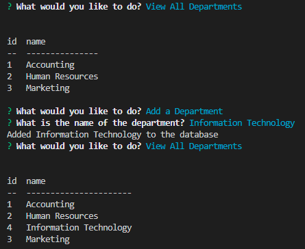

# Nux Evenato XI

## Video Submission Link: https://drive.google.com/file/d/1JD2UC48PyvQLv3Z5Oero8gKgNOejuAky/view

## Description

CLI application for managing employee database utilizing Node.js, inquirer, and MYSQL.

## Installations

Please install the following through your terminal:

```
npm i
```

## Usage

Please run the following through your terminal: 

```
node index.js
```

The user will be prompted to choose from the following options: 


Once all tasks has been done by the user you may choose to quit the application. (Scroll down the choices)


## Screenshot

Below is a screenshot of the functionalities of the application.

<ul>

<li>Adding / Viewing Departments</li>



<li>Adding / Viewing Roles</li>


<li>Adding / Viewing Employees</li>


</ul>

## Credits

The following programs / guides were used to create this project:

<ul>
<li>Node.js - https://nodejs.org/en/</li>
<li>Inquirer.js - https://www.npmjs.com/package/inquirer</li>
<li>Console.Table - https://www.npmjs.com/package/console.table</li>
<li>Mysql2 - https://www.npmjs.com/package/mysql2</li>
</ul>

Thank you to the instructors and TA's that helped with this project.

## License

N/A


